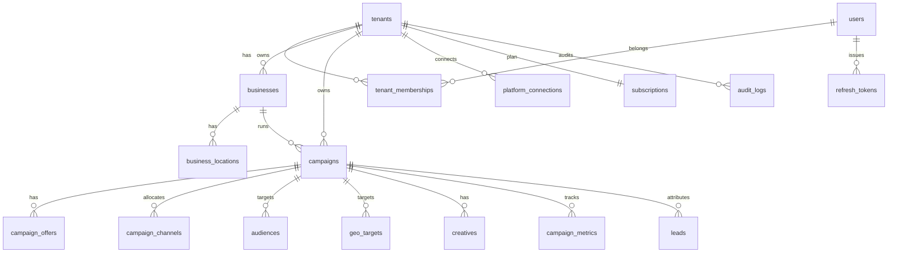

# Fixna LocalBoost — Project State Handoff (no secrets)

**Purpose:** Paste into ChatGPT or another assistant for full project context.  
**Last updated:** 2026-09-28  
**Version:** 1.0.1  
**Domain:** fixna.in  
**Product:** Fixna LocalBoost (local business marketing orchestration SaaS)

---

## 1. Product summary

Fixna LocalBoost helps local businesses (initial market: India / Delhi NCR) define
promotions, geography, audience, and budget; receive AI recommendations; create
campaign creatives; approve campaigns; execute via advertising platform adapters;
and monitor leads and metrics.

Fixna is the orchestration/intelligence layer — not a replacement for Google Ads,
Meta Ads, or WhatsApp. The shared demo uses **mock** AI and **mock** platform adapters.

---

## 2. Architecture

- **Pattern:** Modular monolith (MVP)
- **Backend:** Java 21, Spring Boot 3.x, PostgreSQL, Flyway migrations (V1–V9)
- **Frontend:** Next.js 16.3.6, React 19, TypeScript
- **Source:** GitHub org [fixna-in](https://github.com/fixna-in) / `fixna-localboost`
- **Auth:** JWT access + refresh tokens, BCrypt passwords, RBAC
- **Multi-tenancy:** Shared PostgreSQL schema; `tenant_id` on tenant-owned rows;
  tenant resolved from authenticated identity (never trust client-supplied tenantId)
- **AI:** `AIProvider` abstraction; mock provider in demo; output is schema-validated
- **Platforms:** Adapter pattern for Google/Meta/WhatsApp (mock in demo)

**Dependency direction:** Controller → Application Service → Domain → Repository

---

## 3. Releases

| Version | Date | Summary |
|---------|------|---------|
| **1.0.1** | 2026-09-28 | Health API, Next.js 16, CI/deploy fixes, `fixna-in` org, demo live |
| **1.0.0** | 2026-09-26 | First major release — full MVP + shared demo |

See root `CHANGELOG.md`.

---

## 4. Shared demo deployment (LIVE)

| Layer | Provider | Status |
|-------|----------|--------|
| Database | Neon PostgreSQL (database: `fixna`) | ✅ Live |
| API | Render (Docker, free tier, Singapore) | ✅ Live |
| Frontend | Vercel (root dir: `frontend`) | ✅ Live |
| DNS `api.fixna.in` | CNAME → Render | ✅ Active |
| DNS `app.fixna.in` | CNAME → Vercel | ✅ Active |

### Public URLs

| Purpose | URL |
|---------|-----|
| App (dashboard) | https://app.fixna.in/dashboard |
| App (campaigns) | https://app.fixna.in/campaigns |
| App (login) | https://app.fixna.in/login |
| API (custom domain) | https://api.fixna.in |
| API (Render hostname) | https://fixna-localboost.onrender.com |
| API health (aggregated) | https://api.fixna.in/api/v1/health |
| Actuator health | https://api.fixna.in/actuator/health |

**Render service name:** `fixna-localboost`  
**Spring profile on Render:** `staging` (baked into Dockerfile + dashboard)  
**Abandoned for demo:** Fly.io (config removed from repo)

---

## 4b. Brand mark (unified)

| Location | Implementation |
|----------|----------------|
| Favicon | `frontend/src/app/icon.svg` |
| Apple touch icon | `frontend/src/app/apple-icon.svg` |
| Header / sidebar | `BrandMarkIcon` → `components/ui.tsx` |
| Login/register hero | `BrandMarkIcon` → `components/auth-layout.tsx` |
| **Source of truth** | `frontend/src/brand/brand-mark-graphic.tsx` |

Design: white **f** + lime **•** (`#c7ed94`) on dark green `#163e32` rounded square.

---

## 5. Spring profiles

| Profile | Use |
|---------|-----|
| `local` | Developer machine; optional local test-data seeder |
| `test` | CI / unit tests |
| `staging` | Shared demo — no auto seed, Redis disabled |
| `prod` | Production with fail-fast security validators |

**Staging highlights:** `fixna.test-data.enabled=false`, Redis autoconfig excluded,
`management.health.redis.enabled=false`, `UserDetailsServiceAutoConfiguration` excluded,
mock AI and mock platform adapters.

---

## 6. Environment variables (names only — no real values)

### Render (API)

`SPRING_PROFILES_ACTIVE`, `SPRING_DATASOURCE_URL`, `POSTGRES_USER`, `POSTGRES_PASSWORD`,
`FIXNA_JWT_SECRET`, `FIXNA_CORS_ALLOWED_ORIGINS`, `FIXNA_APP_ENV`, `FIXNA_AI_PROVIDER`,
`FIXNA_PLATFORM_MODE`, `FIXNA_DEPLOYED_AT` (optional), `PORT`

Templates: `infrastructure/demo/render.env.example`, `render.yaml`

### Vercel (frontend)

`NEXT_PUBLIC_API_BASE_URL` (must end with `/api`, e.g. `https://api.fixna.in/api`),
`NEXT_PUBLIC_APP_ENV=demo`

Template: `infrastructure/demo/vercel.env.example`

---

## 7. Demo data (manual in Neon)

App does **not** seed demo data on startup on staging.

| Script | Purpose | Idempotent |
|--------|---------|------------|
| `tools/sql/neon-demo-seed.sql` | User `owner@example.com`, tenant, business, subscription | Skips if user exists |
| `tools/sql/neon-demo-data.sql` | Location, campaigns, leads, metrics | Skips if campaigns exist |
| `tools/sql/demo-data.sql` | Local psql only | — |
| `tools/sql/schema.sql` | Local empty DB bootstrap only | — |

Demo login email: `owner@example.com` (password set by operator via BCrypt hash in DB).

---

## 8. Database — ERD (relationships)

PostgreSQL schema from Flyway V1–V9. All tenant-owned tables include `tenant_id`.

```
tenants ──┬── tenant_memberships ── users
          ├── businesses ── business_locations
          ├── campaigns ──┬── campaign_offers
          │               ├── campaign_channels
          │               ├── audiences
          │               ├── geo_targets
          │               ├── creatives
          │               ├── campaign_metrics
          │               ├── ai_recommendations
          │               └── leads
          ├── platform_connections
          ├── subscriptions (1:1 per tenant)
          ├── audit_logs
          └── refresh_tokens (users)

ai_usage_log — tenant/user ids, no FK (V8)
ai_usage, ai_recommendations — in schema; runtime AI cost uses ai_usage_log
```

### Mermaid ERD (core relationships)



Full diagrams: `docs/02-architecture/diagrams/database-erd.md`

---

## 9. Database — table structure (22 tables)

### V1 — Auth & tenancy

| Table | Key columns |
|-------|-------------|
| `tenants` | id (UUID PK), name, tenant_type, created_at, updated_at |
| `users` | id, email (UNIQUE), password_hash, first_name, last_name, created_at, updated_at |
| `tenant_memberships` | id, tenant_id FK, user_id FK, role, created_at — UNIQUE(tenant_id, user_id) |

### V2 — Business

| Table | Key columns |
|-------|-------------|
| `businesses` | id, tenant_id FK, name, category, description, website_url, phone, created_at, updated_at |
| `business_locations` | id, tenant_id FK, business_id FK, address_line, city, state, postal_code, country, latitude, longitude |

### V3 — Campaigns

| Table | Key columns |
|-------|-------------|
| `campaigns` | id, tenant_id FK, business_id FK, name, objective, status, total_budget (>0), currency, start_at, end_at, external_reference |
| `campaign_offers` | id, tenant_id FK, campaign_id FK, title, description, promo_code |

### V4 — Targeting & creatives

| Table | Key columns |
|-------|-------------|
| `audiences` | id, tenant_id FK, campaign_id FK, name, definition (JSONB) |
| `geo_targets` | id, tenant_id FK, campaign_id FK, target_type, name, latitude, longitude, radius_km, country_code, region_code, city, postal_code |
| `creatives` | id, tenant_id FK, campaign_id FK, channel, headline, body, call_to_action, status (DRAFT/READY) |
| `campaign_channels` | id, tenant_id FK, campaign_id FK, channel, allocated_budget — UNIQUE(campaign_id, channel) |

### V5 — Platform & analytics

| Table | Key columns |
|-------|-------------|
| `platform_connections` | id, tenant_id FK, platform, external_account_id, encrypted_access_token, encrypted_refresh_token, status |
| `campaign_metrics` | id, tenant_id FK, campaign_id FK, metric_date, spend, impressions, reach, clicks, conversions, leads — UNIQUE(campaign_id, metric_date) |
| `leads` | id, tenant_id FK, business_id FK, campaign_id FK, name, phone, email, status, source |

### V6 — AI, billing, audit

| Table | Key columns |
|-------|-------------|
| `ai_recommendations` | id, tenant_id FK, campaign_id FK, recommendation_type, prompt_version, provider, model, payload (JSONB), status |
| `ai_usage` | id, tenant_id FK, provider, model, request_type, input_tokens, output_tokens, estimated_cost, status |
| `subscriptions` | id, tenant_id FK (UNIQUE), plan_code, status, starts_at, ends_at |
| `audit_logs` | id, tenant_id FK, user_id FK, action, resource_type, resource_id, metadata (JSONB) |

### V7 — Auth tokens

| Table | Key columns |
|-------|-------------|
| `refresh_tokens` | id, user_id FK, tenant_id FK, token_hash (UNIQUE), expires_at, revoked, created_at |

### V8 — AI usage log

| Table | Key columns |
|-------|-------------|
| `ai_usage_log` | id, tenant_id, user_id (no FK), recommendation_type, provider, model, prompt_version, input_tokens, output_tokens, estimated_cost_usd, duration_ms, status |

### V9 — Indexes only

Adds indexes on audit_logs, ai_usage_log, subscriptions, businesses, campaigns.

### Key constraints

| Constraint | Table |
|------------|-------|
| UNIQUE email | users |
| UNIQUE (tenant_id, user_id) | tenant_memberships |
| UNIQUE (campaign_id, channel) | campaign_channels |
| UNIQUE (campaign_id, metric_date) | campaign_metrics |
| UNIQUE tenant_id | subscriptions |
| CHECK total_budget > 0 | campaigns |

---

## 10. Project directory structure

```
fixna-localboost/
├── AGENTS.md                      # AI agent development guide
├── CHANGELOG.md
├── README.md
├── render.yaml                    # Render Blueprint (API)
├── docker-compose.yml             # Local Postgres + Redis + Mailhog
├── .env.example                   # Local env template (no secrets)
│
├── .cursor/
│   ├── rules/                     # Cursor agent rules (*.mdc)
│   ├── workflows/                 # Phase workflows 00–14
│   ├── tasks/                     # CURRENT-TASK.md, BACKLOG.md
│   └── memorybank/                # Agent context & this handoff
│
├── .github/workflows/
│   └── ci.yml                     # Backend tests + frontend build
│
├── backend/                       # Spring Boot API
│   ├── Dockerfile                 # Render multi-stage build → fixna-api.jar
│   ├── pom.xml
│   └── src/main/
│       ├── java/in/fixna/platform/
│       │   ├── admin/             # Platform admin
│       │   ├── ai/                # AI recommendations (mock provider)
│       │   ├── analytics/         # Dashboard & metrics
│       │   ├── audience/
│       │   ├── auth/              # JWT auth
│       │   ├── billing/           # Subscriptions & plan limits
│       │   ├── business/
│       │   ├── campaign/          # Lifecycle + launch
│       │   ├── common/            # Config, security, logging, web filters
│       │   ├── creative/
│       │   ├── geo/
│       │   ├── lead/
│       │   ├── notification/
│       │   ├── platform/          # Ad platform adapters (mock)
│       │   ├── tenant/
│       │   └── user/
│       └── resources/
│           ├── application.yml
│           ├── application-staging.yml
│           ├── application-local.yml
│           ├── application-prod.yml
│           ├── application-dev.yml
│           ├── application-test.yml
│           ├── log4j2-spring.xml
│           └── db/migration/      # Flyway V1–V9
│
├── frontend/                      # Next.js (Vercel root directory)
│   ├── vercel.json
│   ├── package.json
│   ├── src/brand/                 # brand-mark-graphic.tsx (canonical f• mark)
│   └── src/
│       ├── app/
│       │   ├── dashboard/         # Analytics overview
│       │   ├── businesses/        # Business list + detail
│       │   ├── campaigns/       # List, new, detail
│       │   ├── leads/
│       │   ├── login/
│       │   └── register/
│       ├── components/            # app-shell, ui, auth-layout
│       └── lib/                   # api-client, auth, campaign APIs
│
├── infrastructure/
│   ├── demo/                      # render.env.example, vercel.env.example
│   └── docker/                    # docker-compose services
│
├── tools/
│   ├── sql/                       # neon-demo-seed.sql, neon-demo-data.sql
│   ├── password-tool.cmd          # BCrypt hash generator (local)
│   └── start-local-demo.cmd       # Local dev launcher
│
├── docs/
│   ├── 00-product/                # Onboarding, business flows
│   ├── 02-architecture/           # System design, ADRs, database-erd.md
│   ├── 03-api/                    # API docs, openapi.yaml (stub)
│   ├── 04-database/
│   ├── 06-ai/                     # AI guardrails
│   └── 07-operations/deployment.md
│
├── requirements/                  # PRD, user stories, acceptance criteria
└── ai/                            # Prompts, schemas, evaluation cases
```

---

## 11. Implemented features (MVP)

### Backend modules
Auth, tenant + RBAC, business + locations, campaigns (CRUD, lifecycle, offers,
channel budgets, idempotent launch), geo, audiences, creatives, AI recommendations
(mock), mock platform adapters, analytics, leads, admin, billing, notifications, audit.

### Frontend (wired to `/api/v1`)
Login/register, dashboard, businesses, campaigns (create, detail, transitions,
launch, AI strategy, geo/audience/creative), leads.

### Campaign status lifecycle
DRAFT → READY_FOR_REVIEW → APPROVED → QUEUED → CREATING → ACTIVE → PAUSED/COMPLETED
(with CREATING → FAILED recoverable path)

---

## 12. CI/CD

| Trigger | Action |
|---------|--------|
| Push/PR to `main`/`develop` | GitHub Actions `ci.yml` — backend tests + frontend build |
| Pull request | `dependency-review` job in `ci.yml` |
| Push to `main` | Render auto-redeploys API (repo: `fixna-in/fixna-localboost`) |
| Push to `main` | Vercel auto-redeploys frontend |

**GitHub org:** https://github.com/fixna-in — reconnect Render/Vercel GitHub apps after org moves.

**Vercel Hobby note:** private org repos require Pro, public repo, or CLI/Actions deploy.

**Backlog:** CI Docker build, coverage gates, Vitest/Playwright, OpenAPI from springdoc.

---

## 13. Observability

### Health API (`GET /api/v1/health`)

Returns `status`, `version`, `deployedAt`, `environment`, `service`, `components`
(`db`, `flyway`, `platform`, …). HTTP 200 when UP, 503 when down. Optional
`FIXNA_DEPLOYED_AT` on Render; version from Maven `build-info`.

### RequestIdFilter

- Sets/propagates `X-Request-Id`; stores in MDC and response header.
- When a Micrometer `Tracer` bean exists, copies `traceId`/`spanId` into MDC.
- Constructor: `RequestIdFilter(Optional<Tracer> tracer)` — empty when tracing off.

---

## 14. Security non-negotiables

- Never trust client-supplied `tenantId`
- No secrets or tokens in logs
- AI cannot spend money or launch campaigns autonomously
- Schema changes = new Flyway migration only
- BCrypt password hashes in DB only

---

## 15. Current status checklist

- [x] Neon database + Flyway migrations
- [x] Render API live (staging profile)
- [x] Vercel frontend live at app.fixna.in
- [x] DNS CNAME active (api + app)
- [x] Demo user + campaign data via Neon SQL
- [x] Unified brand mark (favicon + header + auth hero)
- [x] `RequestIdFilter` Optional&lt;Tracer&gt; + explicit micrometer-tracing dep
- [x] **Version 1.0.1** — health API, Next.js 16, deploy/org fixes
- [x] GitHub org **fixna-in**; Render + Vercel connected and deploying
- [x] Aggregated health at `/api/v1/health`
- [ ] End-to-end smoke: login → dashboard metrics → campaigns on production URLs

---

## 16. Canonical documentation

- Deployment: `docs/07-operations/deployment.md`
- Database ERD: `docs/02-architecture/diagrams/database-erd.md`
- Agent guide: `AGENTS.md`
- Changelog: `CHANGELOG.md`

---

## 17. Do NOT share externally

Neon credentials, JWT secrets, database passwords, API keys, demo user plaintext
password, or Render/Vercel account tokens.
