# Business Flows — Feature-by-Feature Guide

End-to-end workflows for every Fixna LocalBoost capability. Each section lists **purpose**, **UI path**, **API**, **steps**, **rules**, and **common errors**.

Base API path: `/api/v1` (all authenticated endpoints require `Authorization: Bearer <accessToken>`).

---

## Flow overview (happy path)

```mermaid
flowchart LR
    A[Register / Login] --> B[Create Business]
    B --> C[Create Campaign DRAFT]
    C --> D[Geo + Audience + Offers]
    D --> E[Channel Budget Split]
    E --> F[AI Recommendation optional]
    F --> G[Review Creatives]
    G --> H[READY_FOR_REVIEW]
    H --> I[APPROVED]
    I --> J[Request Launch QUEUED]
    J --> K[Execute Launch ACTIVE]
    K --> L[Metrics + Leads]
```



---

## 1. Authentication & session

### Purpose
Secure multi-tenant access with JWT access/refresh tokens and server-side refresh rotation.

### Features

| Feature | UI | API | Notes |
|---------|-----|-----|-------|
| Register | `/register` | `POST /auth/register` | Creates user + tenant; role = TENANT_OWNER |
| Login | `/login` | `POST /auth/login` | Tenant resolved server-side |
| Refresh | (automatic) | `POST /auth/refresh` | Single-use refresh rotation |
| Logout | Sidebar "Sign out" | `POST /auth/logout` | Revokes all refresh tokens |

### Register steps

1. Open `/register`.
2. Enter email, password (min 8), first/last name, **workspace name** (becomes tenant name).
3. Submit → redirected to `/dashboard` with session stored.
4. Backend creates: `users`, `tenants`, `tenant_memberships`, issues JWT pair.

### Login steps

1. Open `/login`.
2. Enter email + password.
3. If user has multiple memberships, server picks active tenant (MVP: first membership).
4. Session restored in browser; API calls attach Bearer token.

### Configuration

- Rate limit: 20 requests/min/IP on `/auth/*` (configurable).
- JWT TTL: `FIXNA_JWT_ACCESS_TTL` (default 15 min), refresh 7 days.
- Failed login returns generic message (no email enumeration in response body).

### Errors

| Code | Meaning |
|------|---------|
| `EMAIL_TAKEN` | Register with existing email |
| `INVALID_CREDENTIALS` | Wrong email/password |
| `RATE_LIMIT_EXCEEDED` | Too many auth attempts (429 + Retry-After) |
| `UNAUTHORIZED` | Missing/invalid token |

---

## 2. Tenant & membership

### Purpose
Isolate each customer organization. Users belong to tenants via memberships with RBAC roles.

### Features

| Feature | UI | API | Who |
|---------|-----|-----|-----|
| View current tenant | (implicit in session) | `GET /tenants/current` | All members |
| Create additional tenant | — | `POST /tenants` | Authenticated user |
| List members | — | `GET /tenants/current/members` | OWNER / ADMIN / AGENCY_ADMIN |
| Remove member | — | `DELETE /tenants/current/members/{userId}` | Admin roles; cannot remove last owner |

### Tenant types

| Type | Use |
|------|-----|
| SMB | Default for registered businesses |
| AGENCY | Agency managing client tenants |
| ENTERPRISE | Future enterprise tier |
| INTERNAL | Fixna platform operators only |

### Rules

- **Never** pass `tenantId` in API bodies for tenant-scoped operations.
- Cross-tenant resource IDs return **404** (not 403) to prevent IDOR leakage.

---

## 3. Businesses & locations

### Purpose
Represent the local business being promoted (cafe, salon, clinic, etc.).

### Features

| Feature | UI | API |
|---------|-----|-----|
| List businesses | `/businesses` | `GET /businesses` |
| Create business | `/businesses` | `POST /businesses` |
| View / edit | `/businesses/{id}` | `GET/PUT /businesses/{id}` |
| Delete | — | `DELETE /businesses/{id}` |
| List locations | `/businesses/{id}` | `GET /businesses/{id}/locations` |
| Add location | `/businesses/{id}` | `POST /businesses/{id}/locations` |

### Create business steps

1. Navigate to **Businesses**.
2. Enter name, category, description, website, phone.
3. Submit → business scoped to current tenant.
4. Optionally add one or more locations (city, address, coordinates).

### Business rules

- Plan limit enforced on create (`PLAN_BUSINESS_LIMIT`).
- VIEWER role cannot create/update/delete.
- All lookups use `(tenantId, businessId)` — never id alone.

### Location fields

| Field | Required | Notes |
|-------|----------|-------|
| `city` | Recommended | Used in geo context |
| `country` | No | Defaults to India |
| `latitude` / `longitude` | For radius targeting | Decimal degrees |

---

## 4. Campaigns & lifecycle

### Purpose
Core advertising unit: budget, objective, schedule, approval, and launch orchestration.

### Campaign objectives

`LEAD_GENERATION`, `STORE_VISITS`, `WEBSITE_TRAFFIC`, `WHATSAPP_ENQUIRIES`, `PROMOTION`

### Status machine

```
DRAFT → READY_FOR_REVIEW → APPROVED → QUEUED → CREATING → ACTIVE
                              ↑           ↓
                              └── FAILED ←┘ (retry via launch)
```

Terminal / operational: `PAUSED`, `COMPLETED`

| Status | Meaning |
|--------|---------|
| DRAFT | Editable; not ready for review |
| READY_FOR_REVIEW | Awaiting human approval |
| APPROVED | Approved; can request launch |
| QUEUED | Launch requested; awaiting execution |
| CREATING | Adapters running |
| ACTIVE | Live (mock) on platforms |
| FAILED | Launch failed; can retry |
| PAUSED / COMPLETED | Post-active states |

### Features

| Feature | UI | API |
|---------|-----|-----|
| List campaigns | `/campaigns` | `GET /campaigns?businessId=` |
| Create campaign | `/campaigns/new` | `POST /campaigns` |
| View campaign | `/campaigns/{id}` | `GET /campaigns/{id}` |
| Update | — | `PUT /campaigns/{id}` (DRAFT only) |
| Delete | — | `DELETE /campaigns/{id}` |
| Transition status | "Advance to …" button | `POST /campaigns/{id}/transitions` |
| Request launch | "Request launch" | `POST /campaigns/{id}/launch` |
| Execute launch | "Execute launch" | `POST /campaigns/{id}/execute-launch` |

### Create campaign steps

1. Click **+ Create campaign** (top bar or campaigns list).
2. Select business, name, objective, total budget (&gt; 0), currency (default INR), optional start/end dates.
3. Campaign created in **DRAFT**.
4. Add geo targets, audiences, offers, channel split (see sections below).
5. Optionally request AI strategy recommendation.
6. Advance: **DRAFT → READY_FOR_REVIEW → APPROVED**.
7. **Request launch** (APPROVED → QUEUED) — idempotent.
8. **Execute launch** (QUEUED → CREATING → ACTIVE or FAILED) — calls mock adapters per channel.

### Transition rules (UI "Advance to …")

| Current | Allowed next (UI) |
|---------|-------------------|
| DRAFT | READY_FOR_REVIEW |
| READY_FOR_REVIEW | APPROVED |
| APPROVED | (use Request launch, not transition) |
| FAILED | (use Request launch to re-queue) |

### Launch rules (non-negotiable)

- Only **APPROVED** or **FAILED** campaigns can enter launch queue.
- Launch is **idempotent** — repeated calls on QUEUED/ACTIVE return current state.
- **AI cannot launch** campaigns; only authenticated users with write role.
- External adapter calls run **outside** DB transactions.

### Offers

| API | Body |
|-----|------|
| `GET /campaigns/{id}/offers` | — |
| `POST /campaigns/{id}/offers` | `title`, `description?`, `promoCode?` |

### Channel budget allocation

| API | Body |
|-----|------|
| `GET /campaigns/{id}/channels` | — |
| `PUT /campaigns/{id}/channels` | `{ channels: [{ channel, allocatedBudget }] }` |

Rules:
- Only in DRAFT or READY_FOR_REVIEW.
- Channel names unique; sum of allocations ≤ total budget.
- UI shortcut: "Split budget GOOGLE/META 50-50" on campaign detail page.

Supported channels (mock): `GOOGLE`, `META`, `WHATSAPP`.

### Errors

| Code | When |
|------|------|
| `CAMPAIGN_LOCKED` | Edit/delete when not in editable state |
| `ILLEGAL_TRANSITION` | Invalid status change |
| `NOT_APPROVED` | Launch from wrong status |
| `CAMPAIGN_NOT_IN_QUEUE` | Execute launch when not QUEUED/CREATING |
| `BUDGET_EXCEEDED` | Channel split over total |
| `PLAN_CAMPAIGN_LIMIT` | Tenant at campaign cap |

---

## 5. Geo targeting

### Purpose
Define where ads should run: radius, city, postal code, region, or country.

### API

Base: `/campaigns/{campaignId}/geo-targets`

| Method | Action |
|--------|--------|
| GET | List targets |
| POST | Add target |
| PUT `/{targetId}` | Update |
| DELETE `/{targetId}` | Remove |

### Target types & required fields

| Type | Required fields |
|------|-----------------|
| RADIUS | `latitude`, `longitude`, `radiusKm` (&gt; 0) |
| CITY | `city` |
| POSTAL | `postalCode` |
| REGION | `regionCode` |
| COUNTRY | `countryCode` |

### UI steps

1. Open campaign detail → **Geo targets** section.
2. Use geo form to add target (e.g. city "Noida" or radius around business).
3. Targets listed under campaign; must belong to same campaign on delete.

### Errors

`INVALID_GEO_TARGET`, `GEO_TARGET_MISMATCH`, `CAMPAIGN_NOT_FOUND`

---

## 6. Audience definitions

### Purpose
Store structured audience criteria for campaign targeting (validated JSON, not free-form LLM output).

### API

Base: `/campaigns/{campaignId}/audiences`

| Method | Body |
|--------|------|
| POST | `{ name, definition }` |
| PUT `/{audienceId}` | Same shape |
| DELETE `/{audienceId}` | — |

### Definition schema (allowed keys)

| Key | Type | Rules |
|-----|------|-------|
| `ageMin`, `ageMax` | number | 0 ≤ min ≤ max |
| `genders` | string[] | non-empty strings |
| `interests` | string[] | non-empty strings |
| `incomeBrackets` | string[] | non-empty strings |
| `deviceTypes` | string[] | non-empty strings |
| `languages` | string[] | non-empty strings |

Unknown keys → `INVALID_AUDIENCE`.

### UI steps

1. Campaign detail → **Audiences** (SubResourceButtons).
2. Create audience with name + criteria JSON.
3. Edit/delete from campaign scope.

---

## 7. Creatives

### Purpose
Draft ad copy and assets metadata. AI suggestions are saved only after human review.

### API

Base: `/campaigns/{campaignId}/creatives`

| Method | Notes |
|--------|-------|
| GET | List creatives |
| POST | Create draft |
| PUT `/{creativeId}` | Update content or status |
| DELETE | Remove |

### Status lifecycle

`DRAFT` → `READY` (ready for campaign review/launch pipeline)

### Creative fields

Typically: headline, description, call-to-action, status. AI `CREATIVE` recommendations suggest headline/description/cta — user copies into creative manually (advisory flow).

---

## 8. AI recommendations

### Purpose
Advisory intelligence for strategy, audience, budget split, and creative direction. **Never** mutates campaigns, budgets, or platform state.

### API

`POST /api/v1/ai/recommendations`

```json
{
  "type": "CAMPAIGN_STRATEGY | AUDIENCE | BUDGET_ALLOCATION | CREATIVE",
  "businessId": "uuid (optional)",
  "campaignId": "uuid (optional)",
  "payload": { }
}
```

### Recommendation types

| Type | Payload hints | Output highlights |
|------|---------------|-------------------|
| CAMPAIGN_STRATEGY | `budget`, `objective` | `objective`, `channels[]`, `recommendedBudget`, `rationale` |
| AUDIENCE | `ageMin`, `ageMax` | `name`, `ageMin`, `ageMax`, `radiusKm` |
| BUDGET_ALLOCATION | `budget`, `channels[{channel, amount}]` | `allocations[{channel, amount}]` |
| CREATIVE | — | `headline`, `description`, `cta` |

### Processing pipeline

1. **Business validation** on request (before LLM call).
2. **Quota check** (plan daily limit).
3. **Provider call** (`MockAIProvider` by default).
4. **Schema validation** on output (untrusted).
5. **Usage + audit** recorded.
6. Recommendation returned to UI — **user decides** what to apply.

### UI steps

1. Open campaign detail.
2. Click **Get strategy recommendation**.
3. Review JSON in page (advisory panel).
4. Manually apply insights to campaign fields, audiences, or creatives.

### Configuration

| Setting | Default |
|---------|---------|
| `fixna.ai.provider` | `mock` |
| `fixna.ai.daily-quota` | 50 (overridden per plan) |

### Errors

| Code | When |
|------|------|
| `AI_VALIDATION_FAILED` | Bad request payload |
| `AI_RESPONSE_INVALID` | Provider output failed schema check |
| `AI_OUTPUT_BUSINESS_INVALID` | Provider output failed business rules |
| `AI_PLATFORM_INCOMPATIBLE` | Output references unsupported platform/channel |
| `AI_PROVIDER_FAILED` | Provider error |
| `AI_QUOTA_EXCEEDED` | Daily limit reached |

---

## 9. Platform connections & launch execution

### Purpose
Link tenant to advertising platforms and execute approved campaigns through adapters.

### Connect platform

| API | Body |
|-----|------|
| `GET /platform-connections` | List connections |
| `POST /platform-connections` | `{ platform: "GOOGLE"|"META"|"WHATSAPP", externalAccountId? }` |
| `DELETE /platform-connections/{platform}` | Disconnect; clears tokens |

Mock mode: no OAuth, no stored credentials.

### Launch execution (two-step)

| Step | API | Effect |
|------|-----|--------|
| 1. Request | `POST /campaigns/{id}/launch` | APPROVED/FAILED → QUEUED |
| 2. Execute | `POST /campaigns/{id}/execute-launch` | QUEUED → CREATING → ACTIVE/FAILED |

Per channel allocation:
- Resolves adapter from registry.
- Calls `AdvertisingPlatformAdapter.launch()`.
- Retries retryable failures up to 3 times.
- External campaign id derived from `external_reference` (idempotent).

### Mock adapter behaviour

- Campaign name containing `"fail"` → transient error (retryable).
- Blank campaign name → permanent rejection.
- Otherwise → `ACTIVE` with deterministic external id.

### Notifications

On terminal launch outcome:
- `campaign.launched` or `campaign.launch_failed` via `NotificationProvider` (logging in MVP).

---

## 10. Analytics & dashboard

### Purpose
Aggregate spend, impressions, reach, clicks, conversions, and leads per tenant and campaign.

### Features

| Feature | UI | API |
|---------|-----|-----|
| Dashboard | `/dashboard` | `GET /analytics/dashboard?from&to` |
| Campaign metrics | — | `GET /analytics/campaigns/{id}?from&to` |
| Ingest metric day | — | `POST /analytics/campaigns/{id}/metrics` |
| Demo seed | "Load demo metrics" | `POST /analytics/demo-seed?campaignId=` |

### Dashboard contents

- **Totals**: spend, impressions, reach, clicks, conversions, leads (date window).
- **Per-campaign rollup**: linked to campaign detail.
- **Lead funnel snapshot**: NEW, CONTACTED, QUALIFIED, CONVERTED, LOST counts.

### Metric ingest (write roles)

```json
{
  "metricDate": "2026-09-25",
  "spend": 0,
  "impressions": 0,
  "reach": 0,
  "clicks": 0,
  "conversions": 0,
  "leads": 0
}
```

Upsert key: `(campaignId, metricDate)` — reposting same day overwrites.

### Demo seed

Deterministic 14-day metrics ending today. Idempotent — same values on re-seed. For demos only; not real ad platform data.

---

## 11. Leads

### Purpose
Capture and manage customer enquiries tied to businesses and optionally campaigns.

### Features

| Feature | UI | API |
|---------|-----|-----|
| List / filter | `/leads` | `GET /leads?businessId&campaignId&status&page&size` |
| Create | — | `POST /businesses/{businessId}/leads` |
| View | — | `GET /leads/{id}` |
| Update status | — | `PATCH /leads/{id}/status` |
| Delete | — | `DELETE /leads/{id}` |

### Lead funnel

```
NEW → CONTACTED → QUALIFIED → CONVERTED
                           ↘ LOST
```

`CONVERTED` and `LOST` are **terminal** — no further status changes.

### Create lead

Body: `name?`, `phone?`, `email?`, `campaignId?`, `source?`

- `businessId` must belong to tenant.
- Optional `campaignId` must belong to tenant.
- Status starts `NEW`.
- Triggers `lead.created` notification.

### UI steps

1. Open **Leads**.
2. Filter by business, campaign, or status.
3. Update status as sales team progresses enquiry.

### Errors

`LEAD_NOT_FOUND`, `LEAD_TERMINAL`, `BUSINESS_NOT_FOUND`, `CAMPAIGN_NOT_FOUND`

---

## 12. Billing & plan limits

### Purpose
Enforce usage caps per subscription tier (no payment processing in MVP).

### View current subscription

`GET /subscriptions/current` → plan code, status, `effectiveLimits`.

### Enforced at

| Action | Limit field |
|--------|-------------|
| Create business | `maxBusinesses` |
| Create campaign | `maxCampaigns` |
| AI recommendation | `maxAiRequestsPerDay` |

---

## 13. Audit log

### Purpose
Immutable record of security and business events for compliance and support.

### Tenant view

`GET /audit?action=&page=&size=` — current tenant only, newest first.

### Platform admin view

`GET /admin/audit?tenantId=&action=&page=&size=` — INTERNAL tenant only.

### Sample actions

`campaign.created`, `campaign.launch_requested`, `campaign.launched`, `ai.recommendation_generated`, `lead.created`, `platform.connected`, `tenant.member_removed`

Metadata is opaque JSON — never includes secrets or tokens.

---

## 14. Platform administration

### Purpose
Fixna operators manage tenants and plans. Gated by **INTERNAL** tenant membership.

| API | Action |
|-----|--------|
| `GET /admin/tenants` | List tenants (paginated) |
| `GET /admin/tenants/{tenantId}/members` | List members |
| `PUT /admin/tenants/{tenantId}/plan` | Set plan (`FREE`, `STARTER`, `GROWTH`) |

Non-INTERNAL callers receive `403 FORBIDDEN`.

---

## 15. Complete E2E checklist (acceptance)

Use this to verify a tenant journey end-to-end:

- [ ] Register new user + tenant
- [ ] Login and land on dashboard
- [ ] Create business with location
- [ ] Connect mock GOOGLE platform
- [ ] Create campaign (DRAFT) with budget and objective
- [ ] Add geo target (city or radius)
- [ ] Add audience definition
- [ ] Add offer and creative draft
- [ ] Split channel budget GOOGLE/META
- [ ] Request AI CAMPAIGN_STRATEGY recommendation
- [ ] Transition DRAFT → READY_FOR_REVIEW → APPROVED
- [ ] Request launch → QUEUED
- [ ] Execute launch → ACTIVE
- [ ] Seed or ingest metrics; verify dashboard
- [ ] Create lead; move through funnel statuses
- [ ] View audit events for tenant
- [ ] (Admin) List tenants and verify plan limits

Automated equivalent: `FixnaEndToEndTest` (requires Docker for Testcontainers).

---

## 16. What is NOT in MVP

| Feature | Status |
|---------|--------|
| Real Google/Meta/WhatsApp APIs | Phase 7 — mocks only |
| Payment / Stripe | Later |
| Email invitations | Later |
| OpenAPI from springdoc | Stub at `docs/03-api/openapi.yaml` |
| Vitest/Playwright frontend tests | Planned |
| Map provider for geo UI | Static/fallback map |

See `requirements/FEATURE-MATRIX.md` for phase planning.
