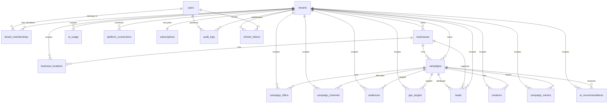
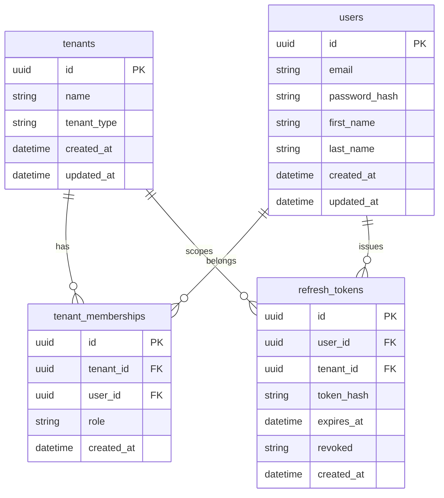
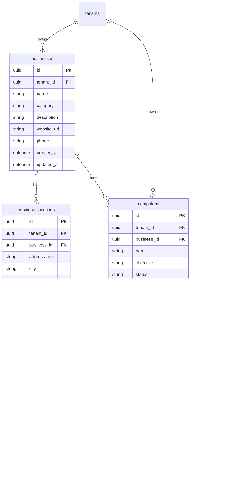
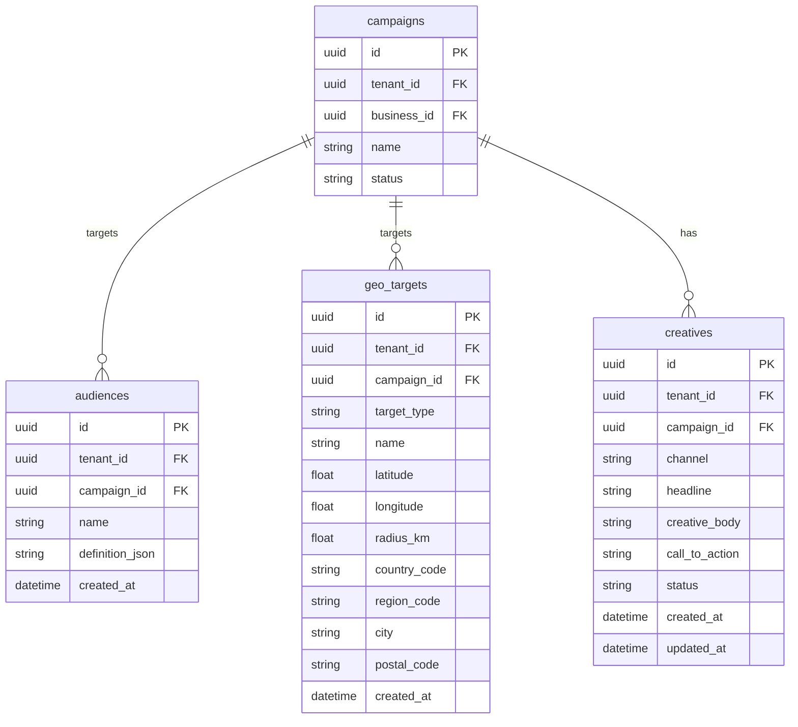
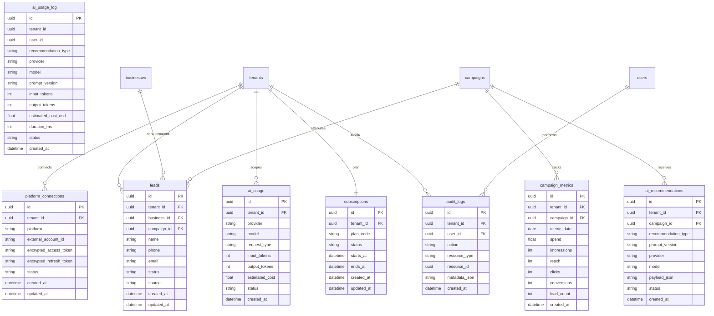
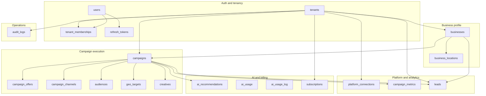

# Database Entity Relationship Diagram

PostgreSQL schema as defined by Flyway migrations `V1`–`V9`.
All tenant-owned tables carry `tenant_id` for multi-tenant isolation (shared schema).

> **Note:** `ai_usage_log` (V8) stores tenant/user ids without FK constraints.
> `ai_usage` and `ai_recommendations` (V6) exist in the schema but are not yet
> mapped by JPA entities; runtime AI cost tracking uses `ai_usage_log`.

## Full ERD (relationships)

Relationship-only diagram — renders reliably in GitHub and Cursor Mermaid previews.

## Auth and tenancy

## Business and campaigns

## Targeting and creatives

## Platform, analytics, AI and billing

## Domain clusters

## Tenancy model

## Key constraints

| Table | Constraint |
|-------|------------|
| `tenant_memberships` | `UNIQUE (tenant_id, user_id)` |
| `campaign_channels` | `UNIQUE (campaign_id, channel)` |
| `campaign_metrics` | `UNIQUE (campaign_id, metric_date)` |
| `subscriptions` | `UNIQUE (tenant_id)` — one plan per tenant |
| `users.email` | `UNIQUE` |
| `refresh_tokens.token_hash` | `UNIQUE` |
| `campaigns.total_budget` | `CHECK (total_budget > 0)` |
| `campaign_channels.allocated_budget` | `CHECK (allocated_budget >= 0)` |

## Migration index

| Migration | Tables |
|-----------|--------|
| V1 | `tenants`, `users`, `tenant_memberships` |
| V2 | `businesses`, `business_locations` |
| V3 | `campaigns`, `campaign_offers` |
| V4 | `audiences`, `geo_targets`, `creatives`, `campaign_channels` |
| V5 | `platform_connections`, `campaign_metrics`, `leads` |
| V6 | `ai_recommendations`, `ai_usage`, `subscriptions`, `audit_logs` |
| V7 | `refresh_tokens` |
| V8 | `ai_usage_log` |
| V9 | indexes only (no new tables) |

## Diagram notes

Mermaid `erDiagram` attribute blocks are sensitive to reserved words and compound
key markers. This file avoids:

- `body` (reserved) — shown as `creative_body`
- `jsonb` columns — shown as `*_json` string fields
- `FK_UK` / `UK` markers — uniqueness documented in the constraints table
- oversized single diagrams — split by domain for reliable rendering
