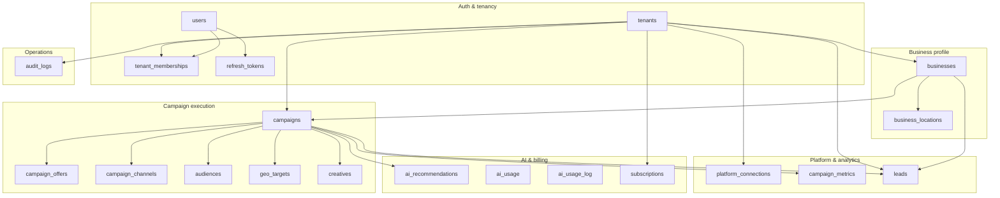
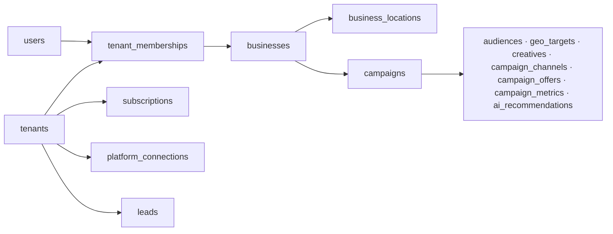

# Database Entity Relationship Diagram

PostgreSQL schema as defined by Flyway migrations `V1`–`V9`.
All tenant-owned tables carry `tenant_id` for multi-tenant isolation (shared schema).

> **Note:** `ai_usage_log` (V8) stores tenant/user ids without FK constraints.
> `ai_usage` and `ai_recommendations` (V6) exist in the schema but are not yet
> mapped by JPA entities; runtime AI cost tracking uses `ai_usage_log`.

## Full ERD

```mermaid
erDiagram
    tenants {
        uuid id PK
        varchar name
        varchar tenant_type
        timestamptz created_at
        timestamptz updated_at
    }

    users {
        uuid id PK
        varchar email UK
        varchar password_hash
        varchar first_name
        varchar last_name
        timestamptz created_at
        timestamptz updated_at
    }

    tenant_memberships {
        uuid id PK
        uuid tenant_id FK
        uuid user_id FK
        varchar role
        timestamptz created_at
    }

    businesses {
        uuid id PK
        uuid tenant_id FK
        varchar name
        varchar category
        text description
        varchar website_url
        varchar phone
        timestamptz created_at
        timestamptz updated_at
    }

    business_locations {
        uuid id PK
        uuid tenant_id FK
        uuid business_id FK
        varchar address_line
        varchar city
        varchar state
        varchar postal_code
        varchar country
        numeric latitude
        numeric longitude
        timestamptz created_at
        timestamptz updated_at
    }

    campaigns {
        uuid id PK
        uuid tenant_id FK
        uuid business_id FK
        varchar name
        varchar objective
        varchar status
        numeric total_budget
        varchar currency
        timestamptz start_at
        timestamptz end_at
        varchar external_reference
        timestamptz created_at
        timestamptz updated_at
    }

    campaign_offers {
        uuid id PK
        uuid tenant_id FK
        uuid campaign_id FK
        varchar title
        text description
        varchar promo_code
        timestamptz created_at
    }

    campaign_channels {
        uuid id PK
        uuid tenant_id FK
        uuid campaign_id FK
        varchar channel
        numeric allocated_budget
        timestamptz created_at
    }

    audiences {
        uuid id PK
        uuid tenant_id FK
        uuid campaign_id FK
        varchar name
        jsonb definition
        timestamptz created_at
    }

    geo_targets {
        uuid id PK
        uuid tenant_id FK
        uuid campaign_id FK
        varchar target_type
        varchar name
        numeric latitude
        numeric longitude
        numeric radius_km
        varchar country_code
        varchar region_code
        varchar city
        varchar postal_code
        timestamptz created_at
    }

    creatives {
        uuid id PK
        uuid tenant_id FK
        uuid campaign_id FK
        varchar channel
        varchar headline
        text body
        varchar call_to_action
        varchar status
        timestamptz created_at
        timestamptz updated_at
    }

    platform_connections {
        uuid id PK
        uuid tenant_id FK
        varchar platform
        varchar external_account_id
        text encrypted_access_token
        text encrypted_refresh_token
        varchar status
        timestamptz created_at
        timestamptz updated_at
    }

    campaign_metrics {
        uuid id PK
        uuid tenant_id FK
        uuid campaign_id FK
        date metric_date
        numeric spend
        bigint impressions
        bigint reach
        bigint clicks
        bigint conversions
        bigint leads
        timestamptz created_at
    }

    leads {
        uuid id PK
        uuid tenant_id FK
        uuid business_id FK
        uuid campaign_id FK
        varchar name
        varchar phone
        varchar email
        varchar status
        varchar source
        timestamptz created_at
        timestamptz updated_at
    }

    ai_recommendations {
        uuid id PK
        uuid tenant_id FK
        uuid campaign_id FK
        varchar recommendation_type
        varchar prompt_version
        varchar provider
        varchar model
        jsonb payload
        varchar status
        timestamptz created_at
    }

    ai_usage {
        uuid id PK
        uuid tenant_id FK
        varchar provider
        varchar model
        varchar request_type
        bigint input_tokens
        bigint output_tokens
        numeric estimated_cost
        varchar status
        timestamptz created_at
    }

    ai_usage_log {
        uuid id PK
        uuid tenant_id
        uuid user_id
        varchar recommendation_type
        varchar provider
        varchar model
        varchar prompt_version
        int input_tokens
        int output_tokens
        numeric estimated_cost_usd
        bigint duration_ms
        varchar status
        timestamptz created_at
    }

    subscriptions {
        uuid id PK
        uuid tenant_id FK_UK
        varchar plan_code
        varchar status
        timestamptz starts_at
        timestamptz ends_at
        timestamptz created_at
        timestamptz updated_at
    }

    audit_logs {
        uuid id PK
        uuid tenant_id FK
        uuid user_id FK
        varchar action
        varchar resource_type
        uuid resource_id
        jsonb metadata
        timestamptz created_at
    }

    refresh_tokens {
        uuid id PK
        uuid user_id FK
        uuid tenant_id FK
        varchar token_hash UK
        timestamptz expires_at
        boolean revoked
        timestamptz created_at
    }

    tenants ||--o{ tenant_memberships : "has members"
    users ||--o{ tenant_memberships : "belongs to"
    tenants ||--o{ businesses : "owns"
    businesses ||--o{ business_locations : "has"
    tenants ||--o{ business_locations : "scopes"
    tenants ||--o{ campaigns : "owns"
    businesses ||--o{ campaigns : "runs"
    campaigns ||--o{ campaign_offers : "has"
    campaigns ||--o{ campaign_channels : "allocates"
    campaigns ||--o{ audiences : "targets"
    campaigns ||--o{ geo_targets : "targets"
    campaigns ||--o{ creatives : "has"
    campaigns ||--o{ campaign_metrics : "tracks"
    campaigns ||--o{ ai_recommendations : "receives"
    tenants ||--o{ campaign_offers : "scopes"
    tenants ||--o{ campaign_channels : "scopes"
    tenants ||--o{ audiences : "scopes"
    tenants ||--o{ geo_targets : "scopes"
    tenants ||--o{ creatives : "scopes"
    tenants ||--o{ campaign_metrics : "scopes"
    tenants ||--o{ ai_recommendations : "scopes"
    tenants ||--o{ ai_usage : "scopes"
    tenants ||--o{ platform_connections : "connects"
    tenants ||--o{ leads : "scopes"
    businesses ||--o{ leads : "captures"
    campaigns ||--o{ leads : "attributes"
    tenants ||--|| subscriptions : "has plan"
    tenants ||--o{ audit_logs : "audits"
    users ||--o{ audit_logs : "performs"
    users ||--o{ refresh_tokens : "issues"
    tenants ||--o{ refresh_tokens : "scopes"
```

## Domain clusters



## Tenancy model



## Key constraints

| Table | Constraint |
|-------|------------|
| `tenant_memberships` | `UNIQUE (tenant_id, user_id)` |
| `campaign_channels` | `UNIQUE (campaign_id, channel)` |
| `campaign_metrics` | `UNIQUE (campaign_id, metric_date)` |
| `subscriptions` | `UNIQUE (tenant_id)` — one plan per tenant |
| `users.email` | `UNIQUE` |
| `refresh_tokens.token_hash` | `UNIQUE` |
| `campaigns.total_budget` | `CHECK (total_budget > 0)` |
| `campaign_channels.allocated_budget` | `CHECK (allocated_budget >= 0)` |

## Migration index

| Migration | Tables |
|-----------|--------|
| V1 | `tenants`, `users`, `tenant_memberships` |
| V2 | `businesses`, `business_locations` |
| V3 | `campaigns`, `campaign_offers` |
| V4 | `audiences`, `geo_targets`, `creatives`, `campaign_channels` |
| V5 | `platform_connections`, `campaign_metrics`, `leads` |
| V6 | `ai_recommendations`, `ai_usage`, `subscriptions`, `audit_logs` |
| V7 | `refresh_tokens` |
| V8 | `ai_usage_log` |
| V9 | indexes only (no new tables) |
